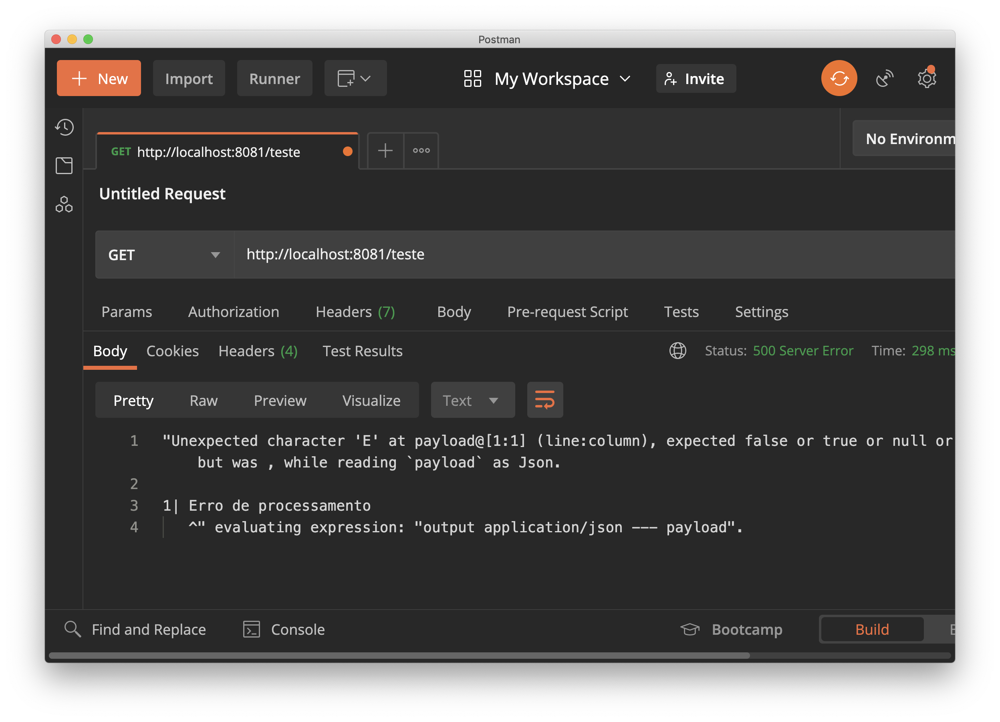

# Desafio: Onde está o erro?

As instruções do desafio estão no post https://mulebr.wordpress.com/2020/12/12/desafio-onde-esta-o-erro/

Temos aqui um fluxo bastante simples:

Entretanto, retorna um erro curioso:

## Pergunta

Qual a causa do erro e como corrigir da forma correta?